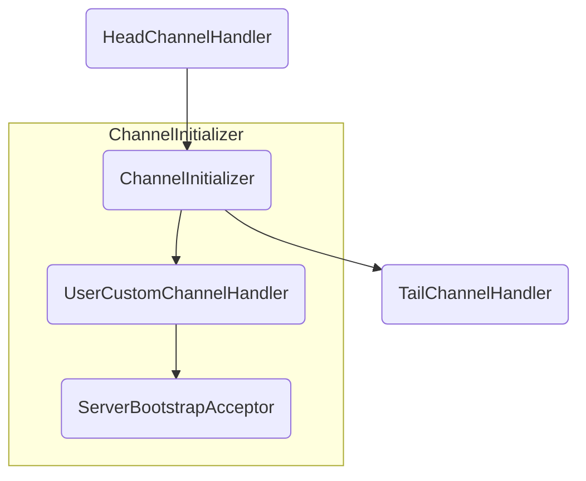

# ServerBootstrap 详解

`ServerBootstrap` 是 `netty` 启动监听服务的启动类, 其承担构建服务端监听者, 并将连接进行初始化配置等操作.

下方是一个简单的 demo 示例, 演示了 `ServerBoostrap` 是如何创建一个监听器, 且如何配置连接相关信息的.

```java
public final class DiscardServer {

    static final int PORT = Integer.parseInt(System.getProperty("port", "8009"));

    public static void main(String[] args) throws Exception {
     
        // bossGroup 用于监听创建新的连接, 并生成对应实体类
        EventLoopGroup bossGroup = new NioEventLoopGroup(1);
        // 连接的处理池, 每个连接都会绑定到一个 EventLoop 中.
        EventLoopGroup workerGroup = new NioEventLoopGroup();

        try {
            ServerBootstrap b = new ServerBootstrap();
            b.group(bossGroup, workerGroup)
             // 定义监听类型
             .channel(NioServerSocketChannel.class)
             // 这个 handler 用于处理新连接进入相关的操作, 可以自定义其他的 handler
             .handler(new LoggingHandler(LogLevel.INFO))
             // 用于对连接进行初始化配置
             .childHandler(new ChannelInitializer<SocketChannel>() {
                 @Override
                 public void initChannel(SocketChannel ch) {
                     ChannelPipeline p = ch.pipeline();
                     p.addLast(new DiscardServerHandler());
                 }
             });

            // Bind and start to accept incoming connections.
            ChannelFuture f = b.bind(PORT).sync();

            // Wait until the server socket is closed.
            // In this example, this does not happen, but you can do that to gracefully
            // shut down your server.
            f.channel().closeFuture().sync();
        } finally {
            workerGroup.shutdownGracefully();
            bossGroup.shutdownGracefully();
        }
    }
}
```

## 参数详解

- `group(EventLoopGroup parentGroup, EventLoopGroup childGroup)`
`parentGroup` 主要用于监听新的连接 (Selector.OP_ACCEPT), 而 `childGroup` 主要处理连接所发生的 OP_READ, OP_WRITE, OP_CONNECT

- `channel(Class<? extends C> channelClass)`
定义当前服务端的服务类型. 例如:
  - `EpollServerSocketChannel` linux EPOLL 连接池
  - `NioServerSocketChannel` Selector 连接池
  - `KQueueServerSocketChannel` MacOS 上的 Epoll 实现.

- `handler(ChannelHandler handler)`
新连接请求数据处理. 

- `childHandler(ChannelHandler childHandler)`
`childHandler` 一般都使用 `ChannelInitializer`, 一个 `ChannelInitializer` 可以对连接的 `pipeline` 进行多次配置, 且在配置完成后会从 `pipeline` 中移除.

## 启动详解

在进行 `bind(PORT)` 操作时整个服务端初始化流程就正式开始.

```java
public ChannelFuture bind(SocketAddress localAddress) {
    // 校验 bossGroup 是否设置
    // 校验是否设置了对应的 ServerChannel
    validate();
    return doBind(ObjectUtil.checkNotNull(localAddress, "localAddress"));
}

private ChannelFuture doBind(final SocketAddress localAddress) {
    // ...
}
```

在 `validate` 中需要确保设置了用于监听和创建连接的 EventLoopGroup, 和所要使用的 `ServerChannel` 类.
在校验完成之后, 则会调用 `doBind` 开始初始化监听服务

```java
private ChannelFuture doBind(final SocketAddress localAddress) {
    // 初始化服务端
    final ChannelFuture regFuture = initAndRegister();

    // ... ignored
}
```

```java
final ChannelFuture initAndRegister() {
    Channel channel = null;
    try {
        // 通过设定的 .channel() 创建一个可用对象
        // 初始化一个 pipeline, pipeline 中只包含 HEAD <-> TAIL 
        // 如果是 NioServerSocketChannel, 则会创建一个监听对象 fd 关注 OP_READ 事件, 并对监听对象设置为非阻塞状态.
        // 同时设置 ServerChannelRecvByteBufAllocator 作为 buffer 分配器.
        channel = channelFactory.newChannel();

        // 调用抽象方法, init() 具体由实现类实现.
        // 这里我们可以看 ServerBootstrap 是如何初始化的.
        init(channel);
    } catch (Throwable t) {
        // ignored
    }

    ChannelFuture regFuture = config().group().register(channel);
    if (regFuture.cause() != null) {
        if (channel.isRegistered()) {
            channel.close();
        } else {
            channel.unsafe().closeForcibly();
        }
    }
    return regFuture;
}

abstract void init(Channel channel) throws Exception;
```

`init()` 方法由 Boostrap 实现类自己实现, 我们使用了 ServerBootstrap.

在 init() 中， 会对监听服务的 `pipeline` 等进行初始化设置.

```java
@Override
void init(Channel channel) {
    setChannelOptions(channel, newOptionsArray(), logger);
    setAttributes(channel, newAttributesArray());

    ChannelPipeline p = channel.pipeline();

    // 用户处理连接数据的 EventLoopGroup
    final EventLoopGroup currentChildGroup = childGroup;
    // 用户自定义的 ChannelInitializer
    final ChannelHandler currentChildHandler = childHandler;

    final Entry<ChannelOption<?>, Object>[] currentChildOptions = newOptionsArray(childOptions);
    final Entry<AttributeKey<?>, Object>[] currentChildAttrs = newAttributesArray(childAttrs);

    final Collection<ChannelInitializerExtension> extensions = getInitializerExtensions();

    // 这里的 ChannelInitializer 是监听服务的, 并非用户自定义的.
    // 这里主要对建立连接的过程进行额外操作.
    // 注意, 这里添加 handler 其实并未实际应用到整个链路中.
    p.addLast(new ChannelInitializer<Channel>() {
        @Override
        public void initChannel(final Channel ch) {
            final ChannelPipeline pipeline = ch.pipeline();
            // 设置监听 handler
            ChannelHandler handler = config.handler();
            if (handler != null) {
                pipeline.addLast(handler);
            }

            ch.eventLoop().execute(new Runnable() {
                @Override
                public void run() {
                    pipeline.addLast(new ServerBootstrapAcceptor(
                            ch, currentChildGroup, currentChildHandler, currentChildOptions, currentChildAttrs,
                            extensions));
                }
            });
        }
    });

    // 设定监听的 OP
    // 初始化 pipeline
    ChannelFuture regFuture = config().group().register(channel);
    // ignored
}
```

这里已经对监听服务进行了 `pipeline` 的初始化, 这个 `pipeline` 只负责新连接建立, 并不负责已建立连接的数据处理.

这内部创建了一个 `ChannelInitializer` 对象, 其包含了2个 Handler. 一个是用户通过 `ServerBoostrap.handler(ChannelHandler)` 定义的, 一个是 netty 强制增加的 `ServerBootstrapAcceptor`. 

还需要注意一点, `ChannelInitializer` 这个虽然通过 `addLast` 添加到了 `pipeline` 中. 但实际这个 `Handler` 状态是 `ADD_PENDING` 状态, 是无法调用的.

那目前 init() 方法结束之后, `pipeline` 将会长成这样:



这是的 `pipeline` 还未初始化, 所有的